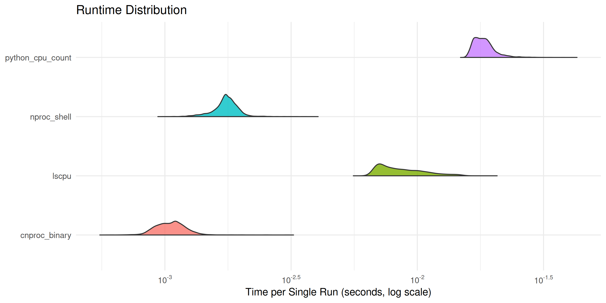

A hyperfine and R plotting workflow.

## Usage

```bash
just run
```
Open `timings.png` and you should see half violin plots.


Measure new commands in `timings.yaml`.
Modify the run recipe in `justfile` to your liking.

## Requirements
- hyperfine ~ 1.18.0
- just ~ 1.21.0
- R ~ 4.3.3
- uv ~ 0.9.8